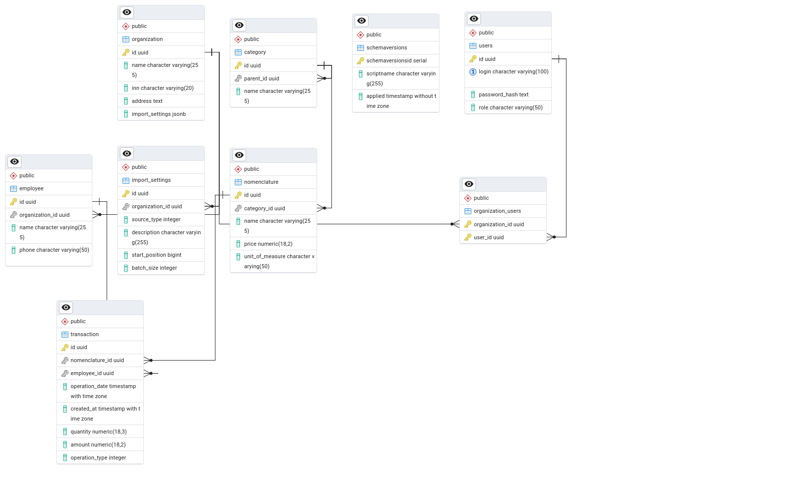

# Техническое описание проекта
Старт проекта: 2026-02-03

### Структура проекта
| № | Модуль                           | Описание                              |
|---|----------------------------------|---------------------------------------|
| 1 | PersonalAccount.Domain           | Общий модуль для всего приложения. Включает доменные структуры (модели, DTO отчетов) и элементы бизнес-логики. |
| 2 | PersonalAccount.Console          | Отдельное приложение клиента для сбора и передачи данных транзакций на сервер. |
| 3 | PersonalAccount.Common           | Общий модуль для хранения интерфейсов и элементов общей логики. |
| 4 | PersonalAccount.Data             | Слой доступа к данным. Содержит миграции, SQL-скрипты, контекст БД и репозитории (ADO.NET / EF Core). |
| 5 | PersonalAccount.Api              | Серверное веб-приложение (API) для обработки входящих данных. |
| 6 | PersonalAccount.UnitTests        | Модульные тесты с мокированием (проверка расчетов отчетов и бизнес-логики). |
| 7 | PersonalAccount.IntegrationTests | Интеграционные тесты для проверки работы с реальной БД (PostgreSQL). |

---

### Последние изменения (Обновления логики)
* **Настройки импорта**: Переведены в формат `JSONB`. Теперь они хранятся непосредственно внутри доменной модели `Organization`. Реализован интерфейс `ILoadingSettingsRepo` для прямого чтения и записи JSON-данных через ADO.NET.
* **Аналитические отчеты**: В доменном слое реализован `ReportRepository` для построения отчетов на основе списка `Transaction`:
  * **Выручка** (разбивка по типу оплат: Наличные/Visa).
  * **Продажи** (группировка по категориям и номенклатуре).
  * **График работы** (формирование рабочих смен на основе транзакций открытия/закрытия).

---

### Описание связей таблиц базы данных (ER-модель)

 

---

### Загрузка и обновление контекста базы данных (PostgreSQL)

Для развертывания или обновления структуры БД выполните следующие шаги:

**Шаг 1. Настройка подключения**
Убедитесь, что в файле конфигурации (например, `appsettings.json` в `PersonalAccount.Data` или `Api`) указана корректная строка подключения к PostgreSQL.

**Шаг 2. Инициализация и обновление структуры (Миграции)**
При использовании ADO.NET и SQL-скриптов, накатывание структуры производится последовательным выполнением файлов из папки `PersonalAccount.Data/Migrations`:
1. Выполнить скрипт `001_schema.sql` (создание таблиц, связей и индексов).
2. Выполнить скрипт `002_create_settings_field.sql` (добавление поддержки JSONB).

*При использовании EF Core:* выполните команду обновления контекста из корня решения:
`dotnet ef database update --project src/PersonalAccount.Data --startup-project src/PersonalAccount.Api`

**Шаг 3. Загрузка тестовых данных (Seeding)**
Для запуска интеграционных тестов и отладки необходимо заполнить базу фиктивными (Mock) данными.
Выполните скрипт `999_mock_data.sql`. 
*Внимание:* Данный скрипт очищает таблицы (`TRUNCATE`) и сбрасывает счетчики `ID` перед вставкой справочников и транзакций.